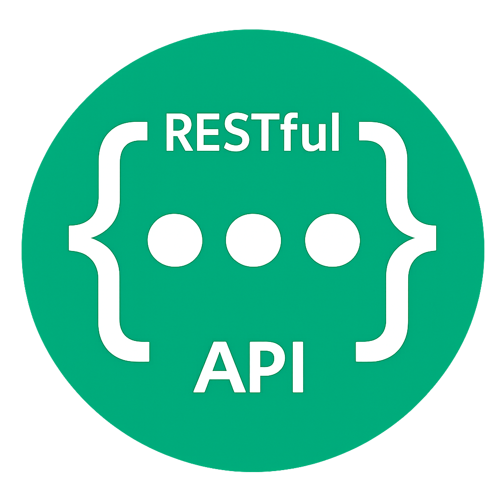

<h2>Hi there, I'm Morteza Aubi 👋</h2>

<h3>🟢 Description</h3>

> _<p>front end developer</p>_
> _<p>i'm junior developer</p>_
> _<p>i will learn react...</p>_

<h3>💻 My Primary Programming Language:</h3>

```javascript
console.log("JavaScript");
```

<h3>🔧 Language And Tools</h3>
<div align="center">
  
  
  
  
  
  
  
  
  
</div>

<h3>📱 Social Media:</h3>
<div align="center">
  <a style="color:initial;" href="https://t.me/MortezaAcm">  </a>
  <a style="color:initial;" href="https://instagram.com/morteza_acm"></a>
  <a style="color:initial;" href="https://www.linkedin.com/in/morteza-acm"></a>
</div>

<h3>✨ Project Links:</h3>
<ol>
  <li>Mini Paint App => <a href="https://mortezaacm.github.io/PointerDraw/">link</a></li>
  <li>Mouse&Touch Follower => <a href="https://mortezaacm.github.io/MouseAndFingerFollower/">link</a></li>
</ol>
